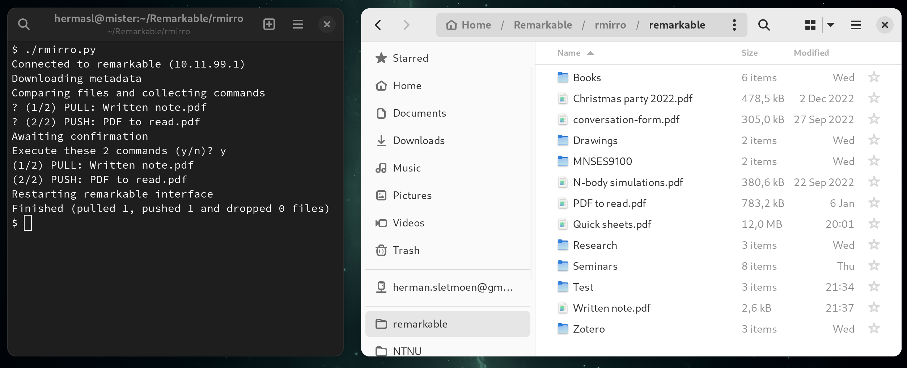

# rmirro

`rmirro.py` **synchronizes files between your reMarkable and computer in both directions** without cloud access.
It renders and **pulls PDFs** of your Remarkable's documents to a folder on your computer,
and **pushes PDFs and EPUBs** that you add to this folder back to the Remarkable.
Effectively, it **integrates your reMarkable with your computer's native file system,**
letting you build your own workflow with your preferred file explorer, document viewer and additional tools on top.

## Requirements

* [Passwordless SSH access](https://remarkablewiki.com/tech/ssh#passwordless_login_with_ssh_keys) to your reMarkable with `ssh remarkable`.
* Access to reMarkable's official PDF renderer through its [USB web interface](https://remarkablewiki.com/tech/webinterface)
  **or** any third-party PDF renderer of raw reMarkable files on your computer, like [maxio](https://github.com/hersle/maxio/tree/overlay).

## Usage and operation

1. Run `git clone https://github.com/hersle/rmirro.git` to download this program.
2. Run `./rmirro.py` to pull *all* your reMarkable's documents into `./remarkable/` (this can take a while).
3. Work on your reMarkable, and add PDFs and EPUBs to `./remarkable/`.
4. Run `./rmirro.py` again to pull changes and push documents added since last time (this skips up-to-date files and runs faster).
5. Go to 3.

### File operations

During synchronization, a file is either

* **pulled** from the reMarkable (RM) to the computer (PC),
* **pushed** from the computer to the reMarkable, or
* **dropped** (deleted or "forgotten") from the computer,

depending on where it is present and when it was last modified:

| If a file is ...                                 | then `rmirro.py` will ...                               |
|:-------------------------------------------------|:--------------------------------------------------------|
| added/modified on RM (more recently than on PC), | pull it to PC.                                          |
| added/modified on PC (more recently than on RM), | push it to RM.                                          |
| deleted on RM,                                   | delete it on PC, too.                                   |
| deleted on PC,                                   | pull it to PC again (delete it on RM to get rid of it). |

Before the program proceeds with any impactful actions, it presents its intentions and prompts for confirmation.
However, it is a hobby project with 0 or more bugs,
so *beware that it has the potential to unexpectedly overwrite and delete files on your reMarkable and computer, and that I take no responsibility if it does!*
[Back up your reMarkable](https://remarkablewiki.com/tech/file_transfer#making_local_backups) to mitigate this!

### Auto-synchronize when the reMarkable is connected by USB cable

This repository contains an [udev](https://en.wikipedia.org/wiki/Udev) rule
that can automatically run `rmirro.py` when you connect your reMarkable to the computer with a USB cable.
If you have root access, you can run `rm_sync_on_connect_setup.sh` to install it.

---

(`rmirro` is what you get by shifting the characters in `mirror` cyclically one step to the right.)
